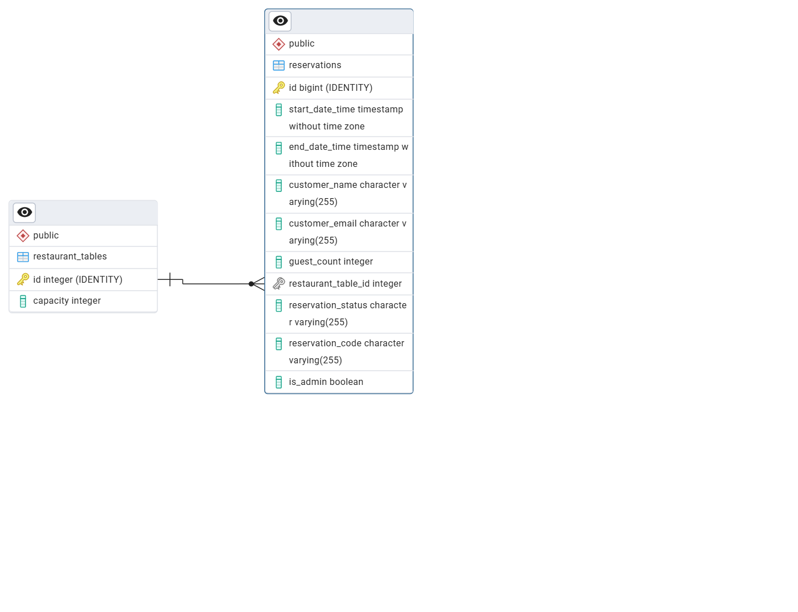

[[database]]

== Структура базы данных

ER-диаграмма таблиц `restaurant_tables` и `reservations`, а также связь один-ко-многим между ними.

=== Описание таблиц

==== restaurant_tables (таблица столиков)

* `id` — первичный ключ, уникальный идентификатор столика.
* `capacity` — вместимость столика (количество гостей).

==== reservations (таблица резерваций)

* `id` — первичный ключ, уникальный идентификатор резервации.
* `reservation_code` — уникальный код резервации.
* `start_date_time` — дата и время начала резервации.
* `end_date_time` — дата и время окончания резервации.
* `customer_name` — имя клиента.
* `customer_email` — email клиента.
* `guest_count` — количество гостей.
* `restaurant_table_id` — внешний ключ на `restaurant_tables.id`, указывающий на забронированный столик.
* `reservation_status` — статус резервации (CONFIRMED, CANCELLED).
* `is_admin` — флаг, показывающий, создана ли резервация администратором.

