:stylesheet: styles.css
:linkcss:

:toc:
:toclevels: 3

[[toc_anchor]]
= Использование

+++++
<a class="back-to-toc" href="#toc_anchor" title="Вернуться к оглавлению">⬆ ВЕРНУТЬСЯ К ОГЛАВЛЕНИЮ РАЗДЕЛА</a>
+++++

* ← НАЗАД: xref:index.adoc#main-toc[ВЕРНУТЬСЯ К ОГЛАВЛЕНИЮ ДОКУМЕНТАЦИИ]

== 1. Функциональные возможности общедоступной страницы

http://localhost:8080/restaurant

=== 1.1 Резервирование столика

==== 1.1.1 Последовательность действий

- На общедоступной домашней странице нажать ссылку "Забронировать столик"

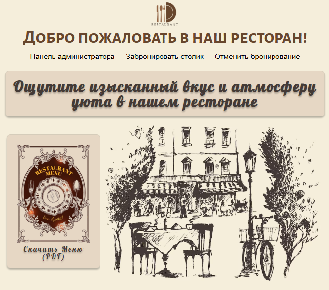

- Заполнить форму бронирования столика и нажать кнопку "Забронировать"

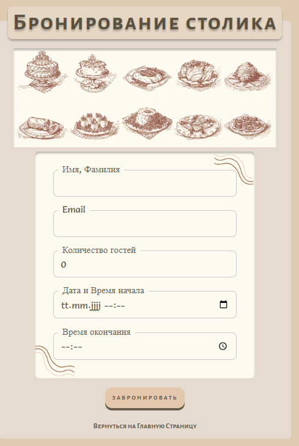

- В случае успешного бронирования открывается окно подтверждения с кодом резервации

image::../images/html-bilder/bestaetigung-info.png[Подтверждение бронирования, width=300]

- Данные сохраняются в базе данных, и клиент получает подтверждение на электронную почту

image::../images/html-bilder/email-confirmation.png[Email-подтверждение бронирования, width=300]

- Если на выбранную дату и количество гостей нет свободных столиков, бронирование отклоняется с соответствующим сообщением

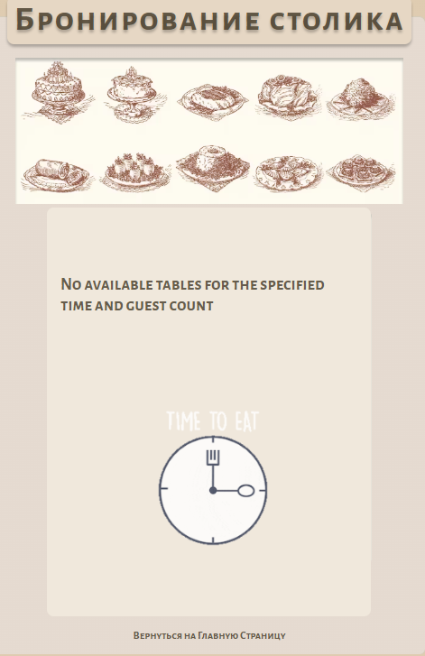

- Если указана дата или время в прошлом, бронирование отклоняется с сообщением об ошибке

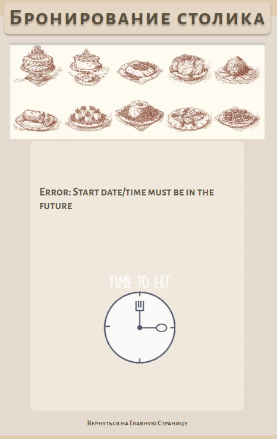

- Если указано время вне часов работы ресторана, бронирование отклоняется с сообщением об ошибке

image::../images/html-bilder/cancellation_not_allowed_time.png[Отклонение бронирования из-за неподходящего времени, width=300]

- При попытке повторного бронирования на тот же email в тот же день бронирование отклоняется

image::../images/html-bilder/cancellation_double_reservation.png[Отклонение повторного бронирования, width=300]

==== 1.1.2 Диаграмма последовательности

Ниже представлена диаграмма последовательности взаимодействия компонентов при успешном создании бронирования:

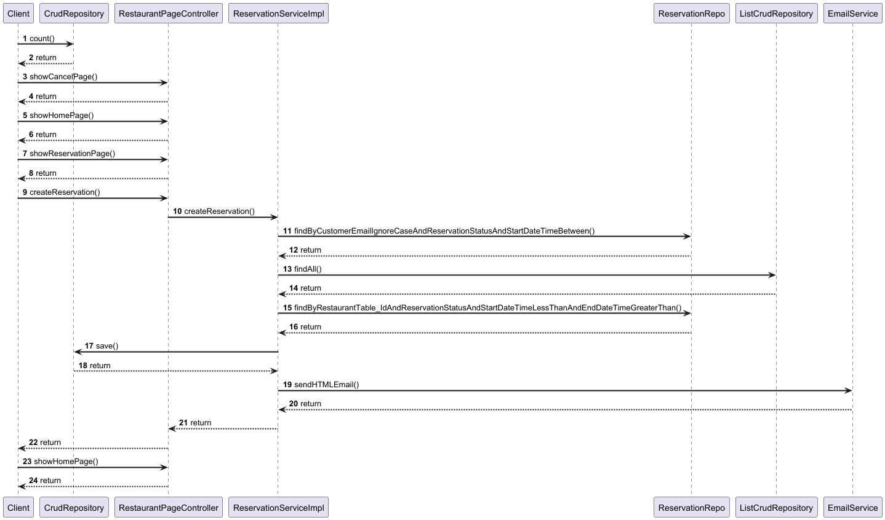

==== 1.1.3 Описание процесса резервирования

. Клиент заполняет форму бронирования и отправляет POST-запрос на `/reservations`, вызывая метод `RestaurantPageController.createReservation()`.
. Контроллер передаёт данные в сервис `ReservationServiceImpl.createReservation()`.
. Сервис проверяет существующие бронирования данного клиента на выбранную дату через метод
`ReservationRepo.findByCustomerEmailIgnoreCaseAndReservationStatusAndStartDateTimeBetween()`.
. Затем сервис запрашивает список всех столиков через `ListCrudRepository.findAll()` и проверяет их занятость,
вызывая `ReservationRepo.findByRestaurantTableAndReservationStatusAndStartDateTimeLessThanAndEndDateTimeGreaterThan()`.
. Если свободный столик с достаточной для количества гостей вместимостью  найден, сервис создаёт объект `Reservation` и сохраняет его в базу данных методом
`ReservationRepository.save()`.
. После сохранения сервис инициирует отправку письма с подтверждением бронирования и уникальным кодом, вызывая
`EmailService.sendHTMLEmail()`.
. Получив подтверждение отправки письма, `ReservationServiceImpl` возвращает результат в контроллер
`RestaurantPageController`.
. Контроллер формирует и возвращает клиенту страницу подтверждения бронирования или сообщение об ошибке.


=== 1.2 Отмена резервации

==== 1.2.1 Последовательность действий

===== a) Точка входа через email

- В письме с подтверждением бронирования нажать ссылку "Отменить резервацию"

image::../images/html-bilder/email-confirmation.png[Email-подтверждение, width=300]

- Открывается форма отмены бронирования, куда нужно ввести код резервации

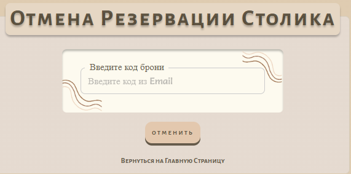

- При успешной отмене (код найден со статусом CONFIRMED) статус меняется на CANCELLED и отображается окно подтверждения

image::../images/html-bilder/cancellation_resevation.png[Подтверждение отмены бронирования, width=300]

- Клиент получает уведомление об отмене на электронную почту

image::../images/html-bilder/email_cansell_reservation.png[Email-уведомление об отмене, width=300]

- Если код не найден или уже отменён, отображается сообщение об ошибке

image::../images/html-bilder/cancell_cancellation.png[Код бронирования не найден, width=300]

===== б) Точка входа через домашнюю страницу

- На домашней странице (http://localhost:8080/restaurant) нажать ссылку "Отменить бронирование"


- Далее процесс аналогичен отмене через email:

** Открытие формы для ввода кода

** Проверка и обновление статуса бронирования

** Появление окна подтверждения или сообщения об ошибке


==== 1.2.2 Диаграмма последовательности

Ниже представлена диаграмма последовательности взаимодействия компонентов при успешной отмене бронирования:

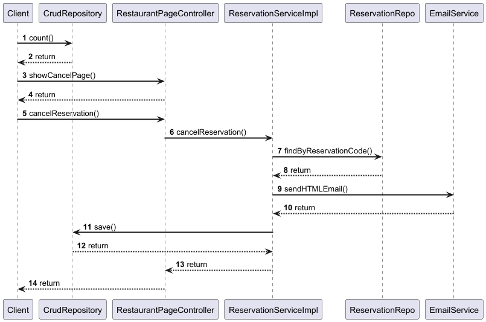

==== 1.2.3 Описание процесса отмены резервирования

. Клиент заполняет форму отмены и отправляет POST-запрос на `/reservations/cancel` через контроллер `RestaurantPageController.cancelReservation()`.
. Контроллер передаёт код бронирования в сервис `ReservationServiceImpl.cancelReservation()`.
. Сервис находит бронь по коду методом `ReservationRepository.findByReservationCodeAndReservationStatus(...)`.
. Если бронь существует и имеет статус `CONFIRMED`, сервис меняет её статус на `CANCELLED` и сохраняет изменения через `ReservationRepository.save()`.
. После сохранения сервис инициирует отправку уведомления об отмене через `EmailService.sendHTMLEmail()`.
. По завершении сервис возвращает результат контроллеру.
. Контроллер формирует и отображает пользователю страницу подтверждения отмены или сообщение об ошибке.


=== 1.3 Скачивание меню

==== 1.3.1 Последовательность действий

- На общедоступной домашней странице (http://localhost:8080/restaurant) нажать кнопку "Скачать меню":


- кнопка "Скачать меню":

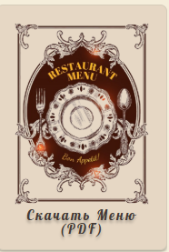

- Актуальное меню в формате pdf скачивается на локальный диск компьютера пользователя

image::../images/html-bilder/current_menu.png[Актуальное меню, width=300]


==== 1.3.2  Диаграмма последовательности взаимодействия компонентов

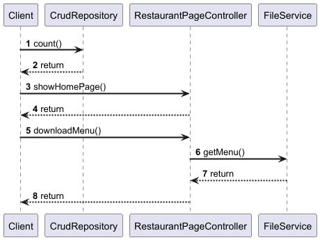

==== 1.3.3 Описание процесса скачивания меню

. Пользователь на общедоступной странице нажимает кнопку "Скачать меню".
. MenuController обрабатывает GET-запрос /menu.pdf и передаёт его в MenuService.
. MenuService загружает PDF-файл меню из хранилища (локальной файловой системы).
. Контроллер формирует ответ с заголовками Content-Type: application/pdf и Content-Disposition: attachment; filename="menu.pdf".
. Браузер клиента получает ответ и автоматически начинает загрузку файла меню на локальный диск пользователя.

== 2. Функциональные возможности панели админа

http://localhost:8080/restaurant/admin

(логин: admin; пароль: secret)

image::../images/html-bilder/admin_panel.png[Панель администратора, width=600]

=== 2.1 Показ списка всех резерваций по дате

==== 2.1.1 Последовательность действий

- На панели администратора заполнить форму "Найти резервации по дате"

image::../images/html-bilder/reservation_by_date.png[Резервации по дате, width=400]

- Нажать кнопку "Показать"

- В окне покажется список всех существующих в базе данных резерваций на указанную дату со статусом COFIRMED

==== 2.1.2 Диаграмма последовательности взаимодействия компонентов

image::../diagrams/reservation_by_date_sequence.png[Диаграмма показа списка резерваций по дате, width=1000]

==== 2.1.3 Описание процесса показа списка резерваций по дате

1. Админ выбирает дату и отправляет запрос `AdminPageController.getReservationsConfirmedByDate(date)`.
2. `AdminPageController` передаёт вызов в `ReservationServiceImpl.getAllReservationByDay(date)`.
3. `ReservationServiceImpl` обращается к `ListCrudRepository.findAll()` для получения списка активных резерваций за указанную дату.
4. `ListCrudRepository` возвращает найденные объекты `Reservation` в `ReservationServiceImpl`.
5. `ReservationServiceImpl` преобразует компоненты в DTO и возвращает список в `AdminPageController`.
6. `AdminPageController` формирует и возвращает клиенту HTTP-ответ со списком резерваций

=== 2.2 Показ списка всех резерваций для конкретного столика на текущий день

==== 2.2.1 Последовательность действий

- На панели администратора заполнить форму "Найти резервации по столику"

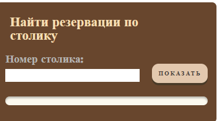

- Нажать кнопку "Показать"

- В окне покажется список всех существующих в базе данных резерваций на текущий день на конкретный столик

image::../images/html-bilder/liste_of_reservations_by_table_number.png[Список резерваций по номеру столика, width=400]


==== 2.2.2 Диаграмма последовательности взаимодействия компонентов

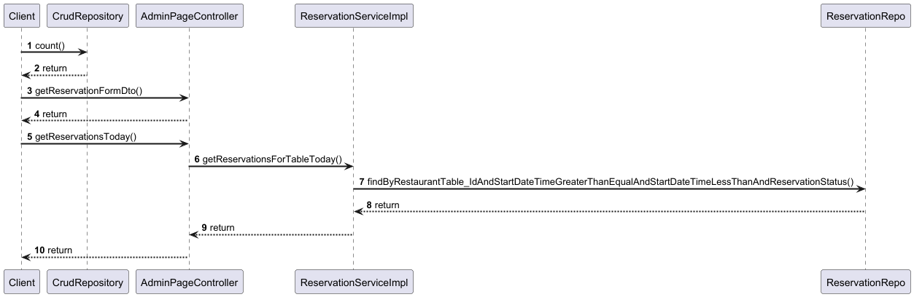

==== 2.2.3 Описание процесса показа списка резерваций по номеру столика на текущий день

. Администратор открывает админ-панель.
. Браузер отправляет GET-запрос к AdminPageController.getReservationFormDto().
. AdminPageController вызывает CrudRepository.count() для получения статистики (например, общего числа резерваций).
. AdminPageController формирует ReservationFormDto (с перечнем доступных столиков) и возвращает его клиенту.
. Браузер отображает форму выбора столика.
. Администратор вводит номер столика и нажимает «Показать».
. Браузер отправляет GET-запрос к AdminPageController.getReservationsToday(tableId).
. AdminPageController вызывает ReservationServiceImpl.getReservationsForTableToday(tableId).
. ReservationServiceImpl обращается к ReservationRepo.findByRestaurantTableAndStartDateTimeGreaterThanEqualAndEndDateTimeLessThanAndReservationStatus() с параметрами: выбранный tableId, начало и конец текущего дня, статус CONFIRMED.
. ReservationRepo возвращает список резерваций, удовлетворяющих условиям.
. ReservationServiceImpl передаёт полученный список обратно AdminPageController.
. AdminPageController формирует HTTP-ответ и возвращает его клиенту.
. Браузер получает ответ и отображает администратору список резерваций на текущий день для выбранного столика.


=== 2.3 Создание резервации с панели админа

==== 2.3.1 Последовательность действий

- На панели администратора нажать ссылку "Создать резервацию", появится форма "Забронировать столик"

- Заполнить форму

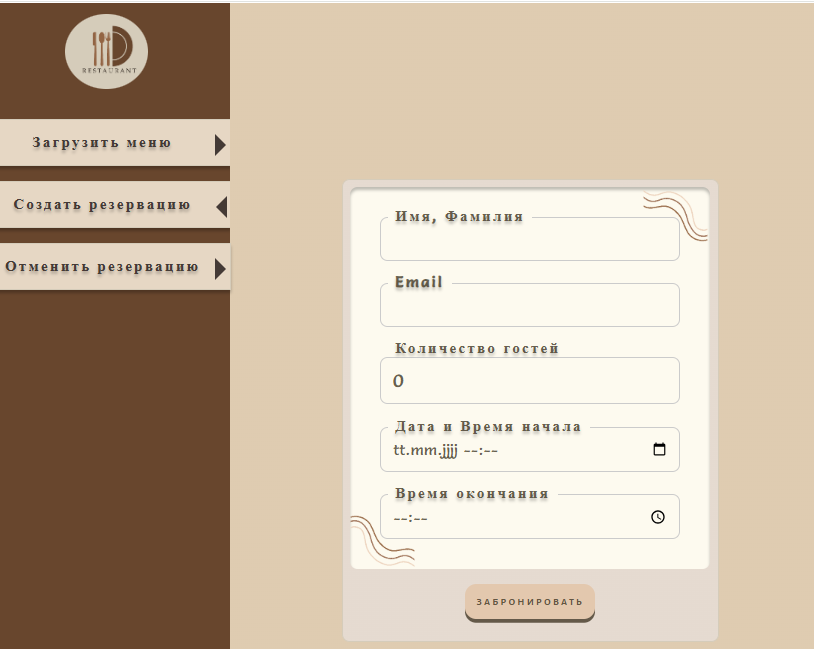

- Нажать кнопку "Забронировать"

Успех резервации отразится в строке внизу под формой.

==== 2.3.2 Диаграмма последовательности взаимодействия компонентов

image::../diagrams/admin_create_reservation_sequence.png[Диаграмма создания резервации с панели админа, width=1000]


==== 2.3.3 Описание процесса создания резервации с панели админа

. Администратор открывает админ-панель.
. Браузер отправляет GET-запрос к AdminPageController.showAdminPanel().
. AdminPageController вызывает getReservationFormDto() и возвращает DTO формы резервации.
. Контроллер отрисовывает страницу админ-панели и отдает клиенту ReservationFormDto.
. Администратор заполняет форму (количество гостей,  дата, время, данные клиента) и нажимает «Забронировать».
. Браузер отправляет POST-запрос к AdminPageController.createReservation() с данными формы.
. AdminPageController передаёт DTO в ReservationServiceImpl.
. ReservationServiceImpl проверяет доступность столика, вызывая
ReservationRepo.findByRestaurantTableAndReservationStatusAndStartDateTimeLessThanAndEndDateTimeGreaterThan()
для указанного интервала времени.
. ReservationRepo возвращает список пересекающихся резерваций (или пустой список).
. Если столик свободен, ReservationServiceImpl сохраняет новую резервацию через CrudRepository.save(). При этом в базе данных тот факт, что резервация создавалась с панели админа, отражается в виде значения true в столбце is_admin.
. После сохранения ReservationServiceImpl вызывает EmailService.sendHTMLEmail() для отправки клиенту письма-подтверждения.
. EmailService возвращает результат отправки, после чего ReservationServiceImpl возвращает контроллеру DTO созданной резервации.
. AdminPageController формирует HTTP-ответ  и отдает его клиенту.
. Браузер получает ответ и отображает администратору уведомление об успешном создании резервации.

=== 2.4 Отмена резервации с панели админа

==== 2.4.1 Последовательность действий

- На панели администратора нажать ссылку "Отменить резервацию", появится форма "Отменить резервацию"

- Заполнить форму

image::../images/html-bilder/admin_cancell_reservation_form.png[Создать резервацию с панели админа, width=400]

- Нажать кнопку "Отменить"

==== 2.4.2 Диаграмма последовательности взаимодействия компонентов

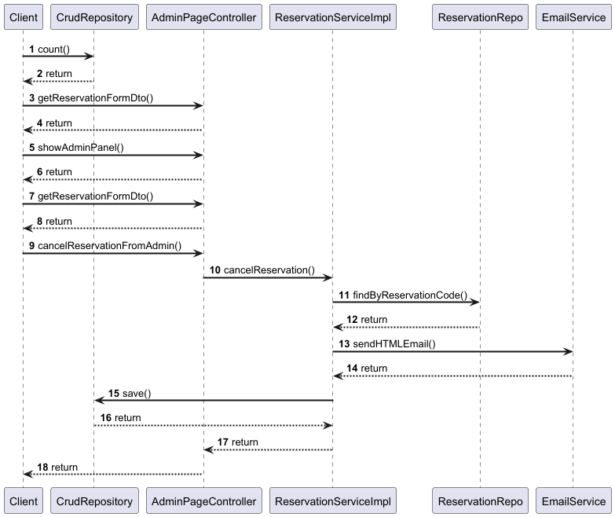

==== 2.4.3 Описание процесса отмены резервирования

Ниже описаны шаги взаимодействия компонентов при отмене бронирования по коду (см. diagram/sequence.puml), а также ключевые действия сервиса для обеспечения корректного выполнения операции.

[cols="1,2,7", options="header"]
|===
|Шаг |Участники |Описание

|1
|Client → AdminPageController
|Клиент (администратор) инициирует отмену, отправляя запрос `cancelReservationFromAdmin(reservationCode)` с уникальным кодом бронирования.

|2
|AdminPageController → ReservationServiceImpl
|Контроллер вызывает метод сервиса:

```
boolean result = reservationService.cancelReservation(reservationCode);
```

Логирование:

```
log.debug("Attempting to cancel a reservation by code: {}", reservationCode);
```

|3
|ReservationServiceImpl → ReservationRepo
|Сервис выполняет поиск бронирования в БД:

```
reservationRepo.findByReservationCode(reservationCode)
```

|4
|ReservationRepo → ReservationServiceImpl
|Репозиторий возвращает `Optional<Reservation>` (с найденным бронированием или пустой).

|5
|ReservationServiceImpl
|Сервис проверяет результат поиска:

* **Если бронирование не найдено**:

* `log.warn("Cancel failed - reservation {} not found", reservationCode);`
* Возвращает `false`, завершает процесс.
* **Если статус уже `CANCELED`**:

* `log.warn("Cancel failed - reservation {} is already canceled", reservationCode);`
* Возвращает `false`, завершает процесс.

|6
|ReservationServiceImpl
|Для действительного и ещё не отменённого бронирования формируется объект `EmailDto`:

```
emailClientDto.setTo(reservation.getCustomerEmail());
emailClientDto.setName(reservation.getCustomerName());
emailClientDto.setStartTime(reservation.getStartDateTime());
emailClientDto.setEndTime(reservation.getEndDateTime());
emailClientDto.setGuestCount(reservation.getGuestCount());
emailClientDto.setSubject("Подтверждение отмены бронирования столика");
emailClientDto.setCancel(true);
```

|7
|ReservationServiceImpl → EmailService
|Сервис отправляет HTML-письмо клиенту:

```
emailService.sendHTMLEmail(emailClientDto);
```

Обработка ошибок:

```
catch (MessagingException e) {
    log.error("Failed to send HTMLEmail {}", e);
    throw new RuntimeException(e);
}
```

|8
|EmailService → ReservationServiceImpl
|Сервис почты возвращает управление (или выбрасывает исключение при ошибке).

|9
|ReservationServiceImpl → ReservationRepo
|Сервис меняет статус бронирования на `CANCELED` и сохраняет обновлённую сущность:

```
reservation.setReservationStatus(ReservationStatus.CANCELED);
reservationRepo.save(reservation);
log.info("Reservation {} canceled successfully", reservationCode);
```

|10
|ReservationServiceImpl → AdminPageController
|Сервис возвращает `true` (успешная отмена) или `false` (отмена не выполнена).

|11
|AdminPageController → Client
|Контроллер перенаправляет или отображает сообщение об результате операции на стороне клиента.
|===


=== 2.5 Загрузка актуального меню в приложение с панели админа


==== 2.5.1 Последовательность действий

- На панели админа (http://localhost:8080/restaurant/admin) нажать ссылку "Загрузить меню":

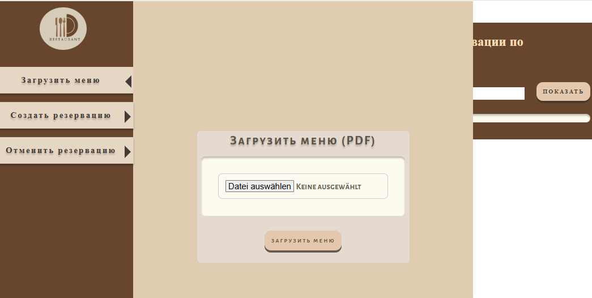

Кликнуть по "Выбрать файл", выбрать файл с меню из соответствующего хранилища файлов

Нажать кнопку "Загрузить меню"

- Актуальное меню в формате pdf скачивается в каталог RestaurantApp/src/main/resources/menus

image::../images/html-bilder/current_menu.png[Актуальное меню, width=300]

==== 2.5.2 Диаграмма последовательности взаимодействия компонентов

image::../diagrams/admin_menu_upload_sequence.png[Диаграмма загрузки меню с панели админа, width=1000]


==== 2.5.3 Описание процесса загрузки меню с панели админа

Ниже описаны шаги загрузки PDF-файла меню с админ-панели (sequence.puml), а также ключевые действия FileService для сохранения нового меню.
[cols="1,2,7", options="header"]
|===
|Шаг |Участники |Описание

|1
|Client → AdminPageController
|Администратор отправляет POST-запрос `uploadMenu()`, передавая PDF-файл меню в параметре `MultipartFile file`.

|2
|AdminPageController → FileService
|Контроллер вызывает метод сервиса:

```
fileService.saveMenuInProjectDir(file);
```

|3
|FileService
|Проверяет MIME‑тип файла:

```
if(!"application/pdf".equals(file.getContentType())) {
    log.error("Only PDF files are allowed");
    throw new IllegalArgumentException("Only PDF files are allowed");
}
```

При несоответствии — логируется ошибка и исключение возвращается контроллеру.

|4
|FileService
|Определяет пути для сохранения:

```
Path uploadPath = Paths.get(uploadDirectory);
Path destination = uploadPath.resolve(MENU_FILENAME);
```

|5
|FileService
|Создаёт директорию `uploadDirectory`, если она отсутствует:

```
if(!Files.exists(uploadPath)) {
    Files.createDirectories(uploadPath);
    log.info("Created menu directory: {}", uploadPath);
}
```

|6
|FileService
|Удаляет старую версию меню, если `current_menu.pdf` уже существует:

```
Path oldMenu = uploadPath.resolve(MENU_FILENAME);
if(Files.exists(oldMenu)) {
    Files.delete(oldMenu);
    log.debug("Deleted old menu file");
}
```

|7
|FileService
|Копирует новый файл в `uploadDirectory`:

```
try(InputStream inputStream = file.getInputStream()) {
    Files.copy(inputStream, destination, StandardCopyOption.REPLACE_EXISTING);
    log.info("New menu was successfully saved.");
}
```

|8
|FileService → AdminPageController
|Метод `saveMenuInProjectDir` завершается (void) — либо контроль возвращается для формирования успешного ответа, либо исключение обрабатывается внешним обработчиком.

|9
|AdminPageController → Client
|Контроллер отправляет HTTP-ответ:

* при успехе — перенаправление на админ-панель,
* при ошибке — сообщение об ошибке загрузки меню.
|===

